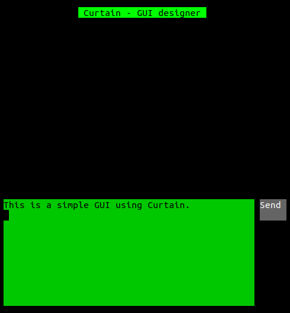
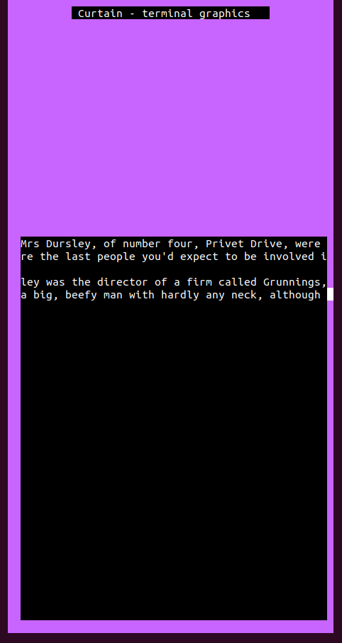

# **CURTAIN**

Curtain provides a simple and easy interface for creating Graphical User Interfaces (GUIs) in your terminal.

 

## **What Can Curtain Do?**
***
Curtain can create simple GUIs made out of the following objects:
+ Rectangles - colored rectangles that can be used to create more complicated shapes and backgrounds.
+ Labels - Rectangles with text.
+ Textboxes - boxes that allow the user to easily input data and pass it on to the program.
+ Buttons - boxes (with a label) that allow the user to "click" them and activate some function.

This basically makes Curtain a decent choice for input-heavy projects that don't require a heavy GUI (Curtain doesn't support moving objects).

### **What Can't Curtain Do?**
Curtain doesn't support moving (or removing, right now) objects. But it *does* support changing an object's text and color/s.

 

## **How Can I Use Curtain?**
***
As of now, Curtain is still not in library form as I'm still developing it and too lazy to relearn CMake for compiling the library. Also, I'm much lazy to document my code, so if you want a quick overview of the important functions, take a look at the example code in [main.c](./src/main.c).

*A simple GUI meant to represent a program for sending/receiving messages (something I'm working on and the main reason I made Curtain)*

 

*A simple GUI with a textbox, source code in a previous commit*