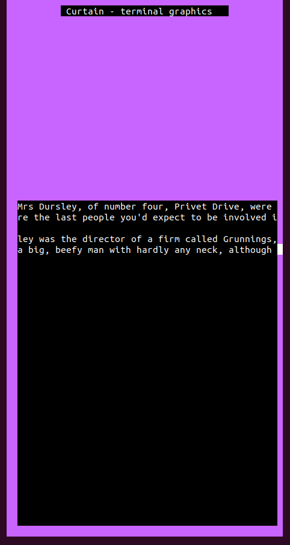

# **CURTAIN**

**This is just a proof of concept, many of the current features will be changed or removed in the future**

Curtain provides a simple and easy interface for printing graphics on your terminal. As of now, Curtain provides just three objects that can be printed:
+ Rectangles - colored rectangles
+ Labels - colored rectangles with colored "immutable" text (as in, its just a char *, not Curtain's string object).
+ Textbox - colored rectangles that allow for user-input during runtime. (Text is also colored).

Curtain is still far from finished, so hopefully more features will be added in the future (along with an actual README). Curtain still needs to be documented.

At this point in time, Curtain is still slow and only supports printing individual objects in their entirety. This means that creating two objects does not in any way link them to each other or some window/universe. This means that moving objects and overlapping them will be a pain at this point in time.  
This also means that if one line in a textbox, or any object changes, the whole object needs to be reprinted, instead of just that line.  
Hopefully these issues will be resolved in the future.

***

*A quick demo of Curtain's abilities right now. The source code can be found in [main.c](./src/main.c)*